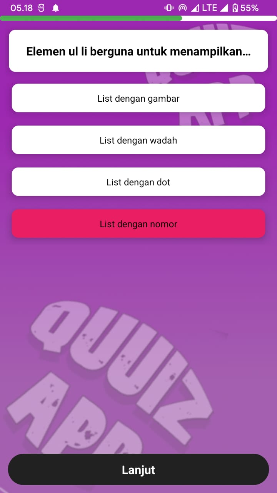

<link rel="shortcut icon" href="favicon.ico" type="image/x-icon">
<link rel="icon" href="favicon.ico" type="image/x-icon">

# Quuiz App
Belajar tidak mengenal batas usia, mari kita belajar bersama dalam satu aplikasi. Cara belajar yang mudah dan cerdas tidak perlu mengeluarkan banyak biaya. Kami akan menyediakan ruang belajar beserta kuis yang menentukan hasil belajar Anda.

## Logo untuk aplikasi
  

## Tangkapan Layar
                     

# Rilis Aplikasi
Version 5.8

1. Prefixed bug

2. Perbaikan sistem HIT

3. Klaim HIT di nilai yang 100

Version 1.0 - 5.7

1. Build Minimalis UI/UX

2. Perbaikan Sistem KoinQuu

3. Riwayat daftar hapus sistem diperbaiki

4. Tidak harus memilih gambar (cek issue)

5. Demo Quuiz

6. Aktifitas baru (Tidak perlu masuk)

7. Perbaikan biometrik

8. Penambahan soal demo (Level 1-2)

9. Penambahan Animasi

10. Navigasi pada main demo Quuiz

11. Navigasi pada fitur pengguna

12. Tukarkan KoinQuu menjadi Rupiah (beta/startup)

13. Pesan untuk publik komunitas

# Keluar saat memilih foto?

1. [Ini solusinya](https://quuizapp.github.io/video/solutionforcecloseaddpic.mp4)

2. Jika gambar tidak muncul coba (tutup dan hapus recent aplikasi) tidak perlu diisi dengan gambar anda. (*This Issue Choose Pic*).

# META PEMBANGUNAN APLIKASI
> Firebase untuk menyimpan, menampilkan, menghapus database, seperti pengguna masuk dengan (auth), diimplementasikan di android studio.

> Android Studio sebagai perangkat lunak pembuatan tampilan dan logika untuk aplikasi Quuiz App.

## Pengembang

# Perangkat lunak yang digunakan
 

# Bahasa Program
 

# Tutorial
Tetap bersamaku untuk belajar :
- Kode (Hanya Kontributor!)
- Video (Hanya Kontributor!)

## Les Privat :
Bertemu langsung atau via online :

### Ikuti media sosial Quuiz App :
 

# Dukung saya
> Saya suka membuat sesuatu yang bisa menginspirasi anda, mungkin itu kelebihan yang Tuhan berikan, tetapi selain itu saya juga butuh makanan untuk melanjutkan hidup saya, saya sangat bersyukur atas semua nikmat yang Tuhan berikan, dan terima kasih untuk kalian semua yang telah membantu saya.

 
